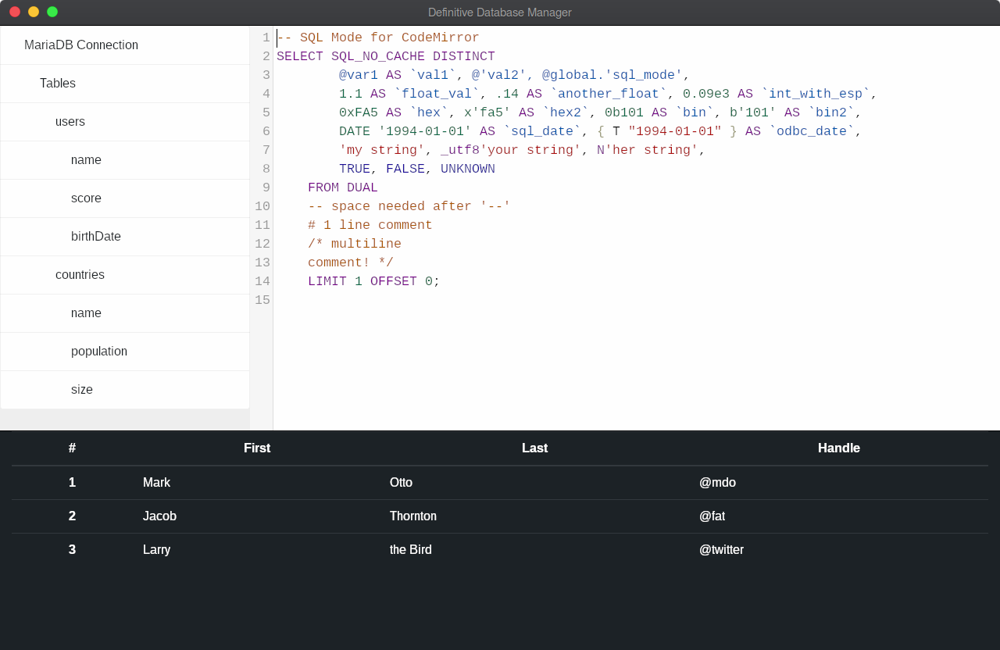

# definitive-database-manager

</img>

https://github.com/ultralight-ux/Ultralight

https://github.com/codemirror/CodeMirror

## How to build it:

``` sh
mkdir build
cd build
cmake ..
cmake --build .
```

## How to execute it:

``` sh
chmod a+x DefiniteDbManager
./DefiniteDbManager
```